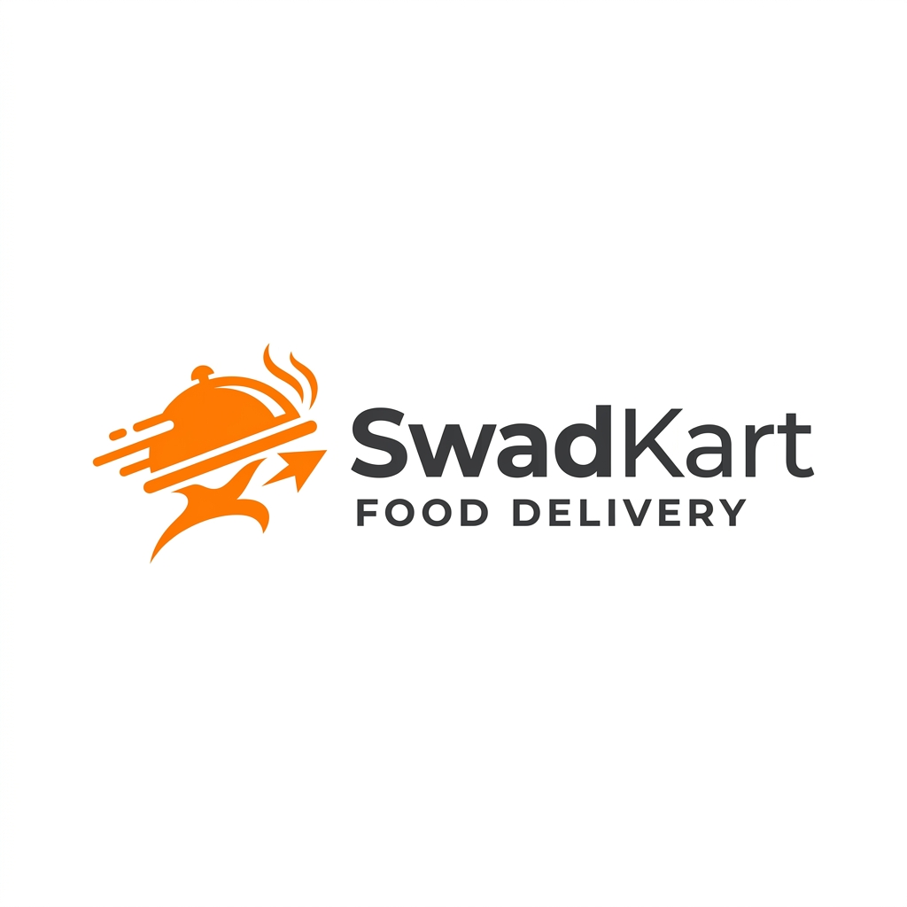

<div align="center">
  
  <h1>SwadKart - Premium Food Delivery Platform</h1>
  <p>
    A high-performance, full-stack food delivery web application built with Java Servlets, JSP, and Vanilla CSS. 
    <br/>
    Designed with a focus on premium aesthetics, glassmorphism UI, and robust backend architecture.
  </p>

  [](https://java.com/)
  [](https://www.mysql.com/)
  [](https://developer.mozilla.org/en-US/docs/Web/CSS)
  [](https://developer.mozilla.org/en-US/docs/Web/JavaScript)
</div>

---

## 🌟 Overview

SwadKart is an enterprise-grade food delivery application inspired by industry leaders like Swiggy and Zomato. It prioritizes a **luxury user experience** using CSS3 micro-animations and smooth gradients, paired with a rock-solid **Java EE** backend utilizing the **DAO (Data Access Object)** and **MVC (Model-View-Controller)** design patterns for extreme scalability and secure code separation.

## 🚀 Key Features

- **Premium Interface**: Dynamic `Vanilla CSS` styling, responsive grid layouts, and glassmorphism styling elements.
- **OTP-Style Authentication**: A low-friction phone-based registration and login system mirroring top-tier delivery apps.
- **Intelligent Browsing**: 
  - Dynamic discovery of Restaurants and Menus.
  - Real-time `Veg/Non-Veg` filtering.
- **Robust Cart & Checkout**:
  - AJAX-powered shopping cart.
  - Multi-step checkout with address management.
- **Secure Data Handling**: JDBC implementation employing `PreparedStatement` to mitigate SQL injection attacks.

## 🏗️ Architecture & Technology Stack

### Backend
- **Core Language**: Java (JDK 8+)
- **Web Technologies**: Java Servlets, JavaServer Pages (JSP)
- **Database**: MySQL Relational Database
- **Design Patterns**: MVC, DAO (Data Access Object), Singleton (for DB Connection)
- **Server**: Apache Tomcat 9/10

### Frontend
- **Structure**: HTML5, JSP Scriptlets
- **Styling**: Responsive Vanilla CSS3 (No Tailwind/Bootstrap reliance)
- **Interactivity**: Vanilla JavaScript, AJAX

---

## 🛠️ Local Development Setup

To run this project locally, follow these steps closely.

### Prerequisites
- [Java Development Kit (JDK) 8 or higher](https://www.oracle.com/java/technologies/downloads/)
- [Apache Tomcat 9.0+](https://tomcat.apache.org/)
- [MySQL Server](https://dev.mysql.com/downloads/installer/)
- IDE: Eclipse EE, IntelliJ IDEA Ultimate, or VS Code (with Java extensions)

### Database Setup
1. Open your MySQL client (e.g., MySQL Workbench).
2. Create the `swadkart` database:
   ```sql
   CREATE DATABASE swadkart;
   ```
3. Import the required schema (Ensure your Users, Restaurants, Menu, Orders, Cart, and Address tables are initialized).

### Environment Variable Configuration (Crucial for Security)
This project maps database credentials using **Environment Variables** securely.

Set the following variables on your operating system before launching your server (or fallback to local defaults in `DBConnection.java` for offline testing):
- `DB_URL` - e.g., `jdbc:mysql://localhost:3306/swadkart`
- `DB_USER` - Your MySQL username (e.g., `root`)
- `DB_PASS` - Your MySQL password

### Running the Application
1. Clone the repository: `git clone https://github.com/Aditya-Ray-03/SWADKART.git`
2. Open the project in your preferred IDE.
3. Add the Apache Tomcat server to your IDE run configurations.
4. Add the `mysql-connector-java.jar` to your application's `/WEB-INF/lib` folder.
5. Build and Deploy the `.war` artifact.
6. Access the application via `http://localhost:8080/SwadKart`.

---

## 📸 Screenshots
> *Currently setting up dynamic screenshots for the preview! You can run the application locally following the steps above to experience the beautiful interface first-hand.*

---

## 📖 Author
**Aditya (Tapan)** 
- Project engineered to demonstrate full-stack capabilities, mastery in MVC architecture, and commitment to premium UI/UX standards.

## 📄 License
This project is for educational and portfolio demonstration purposes.
